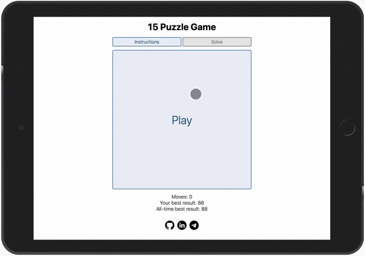

# 🎲 Fifteen Puzzle
The **"15-puzzle"** game (also called Gem Puzzle, Boss Puzzle, Game of Fifteen, Mystic Square and many others) in plain JavaScript.

- [x] Game implementation 
- [x] 4x4 Puzzle
- [x] NxN Puzzle
- [x] Game scores from localStorage
- [x] Game scores from server
- [x] Save and load gaming process
- [x] Solving algorytm implementation
- [x] Known bugs fix
- [ ] Refactoring

### [About game](https://en.wikipedia.org/wiki/15_puzzle) | [View the Demo](https://icherya.github.io/Fifteen-Puzzle/)

**Technology used:**
* HTML
* CSS
* JavaScript
* [Hammer.JS](https://hammerjs.github.io/) for swipe events support.